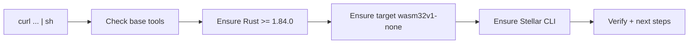

# stellar-start

One-command setup for Stellar smart-contract development on a beginner machine (Linux + macOS).

```sh
curl -fsSL https://raw.githubusercontent.com/Nearx-Labs/stellar-start/main/install.sh | sh
```

That's it. If everything is already installed, the script just verifies and exits — safe to re-run anytime.

## What you get

| Component | Requirement | How the script ensures it |
| --------- | ----------- | ------------------------- |
| Rust toolchain | `>= 1.84.0` via `rustup` | Installs `rustup` if missing, or runs `rustup update stable` if outdated |
| Compilation target | `wasm32v1-none` | Runs `rustup target add wasm32v1-none` if missing |
| Stellar CLI | Latest (or pinned) | Delegates to the official `stellar/stellar-cli` installer; skips if already present |



## Requirements

- Linux or macOS (`x86_64` / `arm64`).
- Windows native is **not** supported — use [WSL2](https://learn.microsoft.com/en-us/windows/wsl/install), open your Ubuntu terminal, and run the command there.
- glibc-based Linux. musl distros (e.g. Alpine) have no prebuilt Stellar CLI binary — use Debian/Ubuntu/Fedora or build from source.
- Internet access to `sh.rustup.rs` and `github.com`.

## Options

```sh
# Show all options
curl -fsSL https://raw.githubusercontent.com/Nearx-Labs/stellar-start/main/install.sh | sh -s -- --help

# No sudo? Install Stellar CLI to ~/.local/bin
curl -fsSL https://raw.githubusercontent.com/Nearx-Labs/stellar-start/main/install.sh | sh -s -- --user

# Pin a Stellar CLI version
curl -fsSL https://raw.githubusercontent.com/Nearx-Labs/stellar-start/main/install.sh | sh -s -- --stellar-version=27.0.0 --user

# Force-reinstall Stellar CLI (default is to skip when already present)
curl -fsSL https://raw.githubusercontent.com/Nearx-Labs/stellar-start/main/install.sh | sh -s -- --force
```

| Flag | Description |
| ---- | ----------- |
| `-y, --yes, --minimal` | Non-interactive (default behavior, kept for clarity) |
| `--force` | Reinstall Stellar CLI even if already present |
| `--user` | Install Stellar CLI to `~/.local/bin` (no sudo needed) |
| `--dir=PATH` | Install Stellar CLI to a custom directory |
| `--stellar-version=VER` | Pin a version, e.g. `27.0.0` or `v27.0.0` (default: latest) |
| `-h, --help` | Show help |

Prefer a reproducible onboarding link? Pin to a tag:

```sh
curl -fsSL https://raw.githubusercontent.com/Nearx-Labs/stellar-start/v1.0.0/install.sh | sh
```

## Verify your installation

```sh
rustc --version        # must be >= 1.84.0
rustup target list --installed | grep wasm32v1-none
stellar --version
```

Expected (versions may be newer on your machine):

```text
rustc 1.98.1 (48a229cea 2026-09-01)
wasm32v1-none
stellar 27.0.0 (5a7c5fe76530bf4248477ac812fc757146b98cc4)
```

Then try:

```sh
stellar --help
```

Full CLI reference: https://developers.stellar.org/docs/tools/cli/stellar-cli.md

## Editor setup (manual, one time)

The script intentionally does not install editors. Pick your editor, then add Rust support:

1. [Visual Studio Code](https://code.visualstudio.com)
2. [Rust Analyzer](https://marketplace.visualstudio.com/items?itemName=rust-lang.rust-analyzer) — Rust language support
3. [CodeLLDB](https://marketplace.visualstudio.com/items?itemName=vadimcn.vscode-lldb) — step-through debugging

Or from the terminal, if you already have VS Code:

```sh
code --install-extension rust-lang.rust-analyzer
code --install-extension vadimcn.vscode-lldb
```

General Rust editor docs: https://www.rust-lang.org/tools

## Shell completion (recommended)

Stellar CLI can complete your commands like a superpower. Enable for your shell:

```sh
# Bash — current session
source <(stellar completion --shell bash)
# Bash — permanently
echo "source <(stellar completion --shell bash)" >> ~/.bashrc

# ZSH — current session
source <(stellar completion --shell zsh)
# ZSH — permanently
echo "source <(stellar completion --shell zsh)" >> ~/.zshrc
```

Other shells (`fish`, `powershell`, `elvish`): run the installer once and copy the line it prints for your shell.

## Troubleshooting

**`stellar: command not found` after install.**
The install directory is not on your `PATH`. The script prints the exact directory — usually `$HOME/.local/bin`. Fix it, then restart the terminal:

```sh
export PATH="$PATH:$HOME/.local/bin"
stellar --version
```

**`rustup: command not found` after install.**
Your shell hasn't picked up Cargo yet. Restart the terminal, or run:

```sh
source "$HOME/.cargo/env"
rustc --version
```

**`rustc` older than `1.84.0`.**
```sh
rustup update stable
rustup target add wasm32v1-none
```

**`Missing required command(s)`.**
Install the listed tools with the command the script prints for your distro (`apt` / `dnf` / `yum` / `pacman` / `zypper` / `brew`), then re-run.

**musl / Alpine error.**
Prebuilt Stellar CLI binaries target glibc. Switch to a Debian/Ubuntu/Fedora image, or build the CLI from source.

**Emojis show as `?` on Windows.**
Cosmetic only — use [Windows Terminal](https://learn.microsoft.com/en-us/windows/terminal/install). The CLI works normally.

**Something else broke in Stellar CLI?**
Report it upstream: https://github.com/stellar/stellar-cli/issues/new/choose

## Updating

Re-run the script — it updates outdated pieces and skips what is already fine:

```sh
curl -fsSL https://raw.githubusercontent.com/Nearx-Labs/stellar-start/main/install.sh | sh
```

To force a fresh Stellar CLI (e.g. a new release came out):

```sh
curl -fsSL https://raw.githubusercontent.com/Nearx-Labs/stellar-start/main/install.sh | sh -s -- --force
```

## Uninstalling

```sh
# Remove the Stellar CLI binary (adjust the path if you used --dir)
rm "$(command -v stellar)"

# Optionally remove the Rust toolchain entirely
rustup self uninstall
```

## Local development

```sh
chmod +x install.sh
shellcheck install.sh
./install.sh --help
./install.sh --user
```

## Security

Prefer `curl -fsSL` over a bare `curl | sh`, pin onboarding links to a tag (`/v1.0.0/install.sh`), and review the script before piping it to a shell on shared machines.
